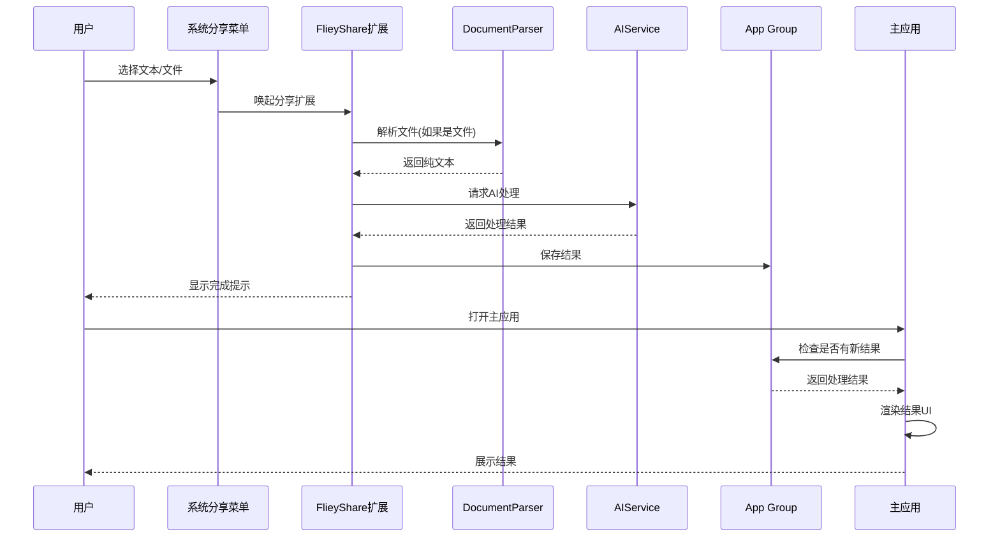

# Fliey 架构设计草图

## 功能流程图

Share Sheet → FlieyShare Extension
↘︎ (调用 WritingTools Service)
Main App ← SharedCore (DocumentParser + AIService)

markdown
复制
编辑

## 模块拆分

| 层级         | 说明 |
|--------------|------|
| **SharedCore** | 纯 Swift，可在 Windows 编译；负责解析 PDF/DOCX、调用 WritingTools；所有业务逻辑集中于此 |
| **FlieyApp**  | SwiftUI 主程序；文档导入、结果展示、Widget/Shortcut 调度 |
| **FlieyShare**| 系统 Share Extension，选中文本或文件后唤起；UI 极简，只负责把请求传给 SharedCore |

## 数据流描述

> 文本 / 文件路径 → `DocumentParser` → plain text → `AIService` → summary / translation → 回传 UI

## 组件间通信

Fliey 采用 App Group 机制实现 Extension 与主应用之间的数据共享：

1. Share Extension 在完成 AI 处理后，将结果写入 App Group（UserDefaults）
2. 主应用启动或从后台返回时检查 App Group，读取并渲染处理结果
3. `SharedResultBridge` 工具类封装了这一通信机制，简化跨组件调用

### 数据流示意图

### 详细流程

## 技术栈

- **Swift** + **SwiftUI**: 主要开发语言和UI框架
- **Apple Intelligence API**: iOS 18+ 提供的 WritingTools 服务
- **PDFKit**: 解析PDF文档
- **App Group**: 跨Extension通信
- **Shared UserDefaults**: 共享设置和结果 

> Day 7 已完成：SwiftUI 原型三分屏 + 假数据流通 